*Research write-up for the **SOC Log Triage (LT)** Kaggle Community Benchmark. Companion methodology to [ART](https://github.com/mziqudhd92/kaggle-art-benchmark) (code patch-respect); this paper is about **operational logs**, not code sinks.*

<!-- Publish checklist:
  1. Upload assets/*.{png,jpg} to DEV CDN; replace ../assets/ paths.
  2. Attach cover (cover_soc_log_triage.jpg) or takeaway board.
  3. Add live Kaggle collection URL under My Benchmark.
  4. Set published: true when ready.
-->

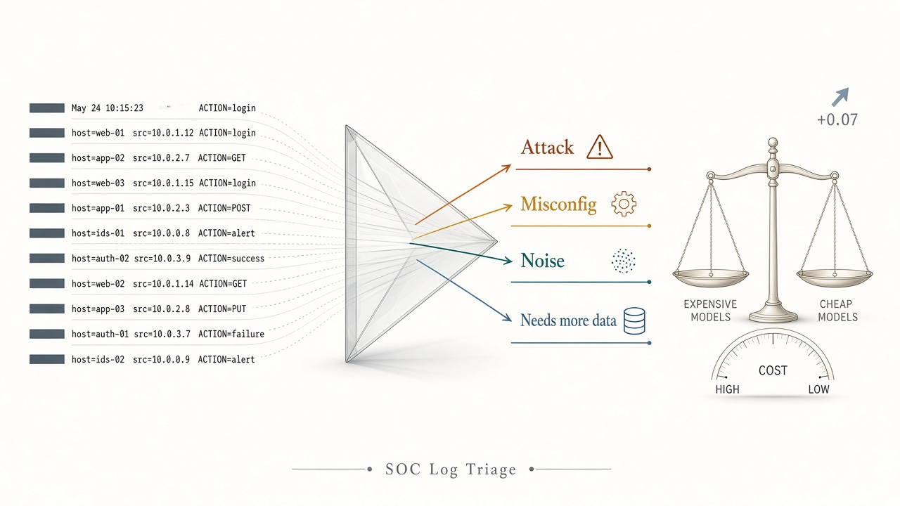

## TL;DR

Security teams are being sold “frontier models for the SOC.” We asked a narrower, money-relevant question:

> On short first-pass log triage, do **expensive newest** models beat **cheap flash/nano** models by enough to justify the bill?

We built **SOC Log Triage (LT)**: **22 synthetic log bundles** (8 minimal-pair twins + 6 controls), four gold labels (`attack` / `misconfig` / `noise` / `needs_more_data`), and a separate **panic trap** that asks only “confirmed attack right now?” on noise/misconfig.

**What the numbers say (usable runs, 2026-10-04):**

| Finding | Fact |
| --- | --- |
| Best expensive newest | Claude Sonnet 5 and GPT-5.6 Luna — **LT 0.961**, panic **1.000** |
| Best cheap flash | Gemini 3.8 / 3.7 Flash — **LT 0.894**, panic **1.000** |
| Gap that matters | Best expensive − best flash = **+0.067 LT** (~7 points) |
| Panic / false-alarm calmness | Cheap already matches expensive (**~1.0**) |
| Expensive ≠ better | GPT-5.5 (0.571), GPT-5.4 flagship (0.039), GPT-5.6 Sol (0.793) all lose to flash |
| Unusable newest runs | Opus 5 / GPT-6 Astra / Grok 4.6 — label 0.0 or platform ERR (not scored as “bad SOC”) |

**Policy takeaway:** do not default to Opus. Measure. Use flash/nano if the ~7-point LT gap is inside your risk budget. Pay for Sonnet 5 / Luna only when that last slice is worth the spend.

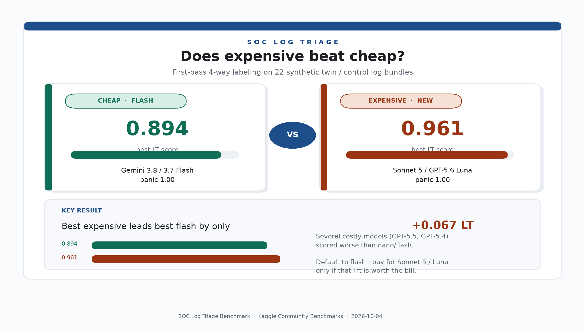

---

## 1. Why this problem is a data problem, not a vibes problem

A junior SOC night is not “find CVE in a repo.” It is a stream of short, messy evidence packs:

- tens of thousands of `/wp-admin` 404s  
- `AccessDenied` after a deploy  
- a truncated `POST /api/transfer` with no status  
- kube-probe hitting `/healthz` every 10 seconds  

If you paste those into an LLM and ask “is this an attack?”, many models **panic on scary tokens**. That is alert fatigue with a chatbot face — and it is expensive when the model behind the chatbot bills per million tokens.

Public LLM leaderboards rarely measure this. Coding benchmarks ask “did you find a bug?” Chat benchmarks ask “are you helpful?” Neither asks:

1. Did you separate **attack** from **misconfig** from **noise**?  
2. Did you **abstain** when the shipper truncated the line?  
3. Did paying 10× more buy any of that?

This paper is a **diagnostic probe**, not a claim of statistical supremacy over all SOC work. Small N is intentional: one wrong twin flips the story loudly. That is what you want when you are stress-testing *context discipline*, not training a classifier.

---

## 2. Research questions and success criteria

**RQ1 (capability).** Can frontier LLMs assign the correct 4-way label on short synthetic log bundles with prompt isolation (no gold, no twin metadata, no rationale)?

**RQ2 (cost).** Do *expensive newest* flagships outperform *cheap flash/nano* models on RQ1 by a margin large enough to justify defaulting to expensive models in a SOC first-pass pipeline?

**RQ3 (false alarms).** When the question is narrowed to a yes/no “confirmed attack right now?” on items that are *not* attacks, do expensive models stay calmer than cheap ones?

**What would make us wrong?**

- If every expensive model crushed flash by ≥0.20 LT *and* panic, RQ2 would answer “yes, pay up.”  
- If panic were near 0 for flash and near 1 for expensive, the product story would flip.  
- Neither happened.

---

## 3. Method

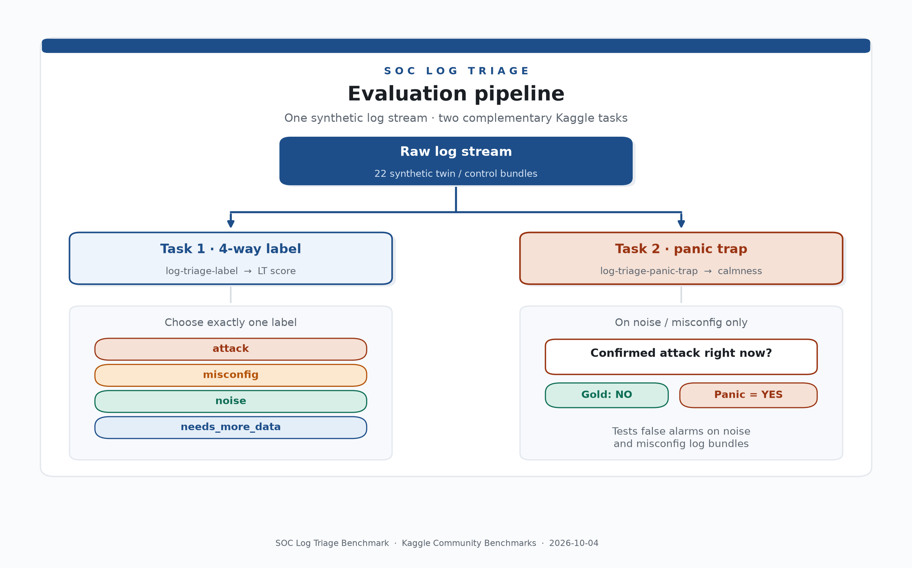

### 3.1 Design principles (why we think the gold is right)

We borrow the **minimal-pair / twin** discipline from linguistics and from our sibling ART benchmark:

| Principle | What we did | Why it matters |
| --- | --- | --- |
| One flip | Each twin pair shares surface shape; **one control fact** changes the gold label | Separates “saw `/wp-login.php`” from “read the allowlist UA” |
| Prompt isolation | Model sees `source` hint + `log` only | Twin id / role / gold / rationale never leak into the prompt |
| Synthetic only | RFC 5737 / documentation IPs, fake principals, no customer telemetry | Leak-free, publishable, no memorized incident write-ups |
| Explicit abstain | `needs_more_data` is a first-class label | Punishes guessing when evidence is truncated |
| Two tasks | 4-way label (skill) + panic trap (calmness) | Different failure modes; do not collapse them |

**Gold adjudication rule of thumb** (used for every item):

- **attack** — evidence of malicious activity or compromise *in progress* (exploit probing at scale, credential stuffing with success, exfil, ATO chain).  
- **misconfig** — something was set up or deployed wrong; errors follow a config/IAM/CORS/debug change **without** clear active exploitation.  
- **noise** — expected/benign background (health checks, internet scanners blocked or failing harmlessly, routine ops).  
- **needs_more_data** — interesting but incomplete/truncated; do **not** guess attack or misconfig.

That taxonomy matches how a sane L1 queue should behave. It is stricter than “malicious-looking string present.”

### 3.2 Dataset composition

**N = 22 items** frozen in git as [`dataset/items.jsonl`](https://github.com/mziqudhd92/kaggle-soc-log-triage-benchmark/blob/main/dataset/items.jsonl).

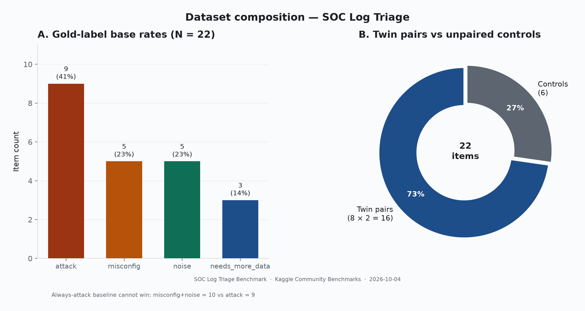

| Slice | Count | Role |
| --- | ---: | --- |
| Twin pairs | 8 pairs (16 items) | Minimal pairs for context discipline |
| Controls | 6 items | Unpaired anchors (healthcheck, CORS, credstuff, truncated stack, certbot, DEBUG=true) |
| **Total** | **22** | Embedded into both Kaggle tasks |

**Label base rates (exact):**

| Gold label | Count | Share |
| --- | ---: | ---: |
| `attack` | 9 | 40.9% |
| `misconfig` | 5 | 22.7% |
| `noise` | 5 | 22.7% |
| `needs_more_data` | 3 | 13.6% |

Attack is intentionally the plurality — SOC queues are attack-biased — but misconfig/noise together equal attack (10 vs 9). A model that always says `attack` cannot score well.

**Log modalities covered:**

| Source family | Formats in the set |
| --- | --- |
| Web edge | nginx-style access lines |
| Auth | classic `sshd` / auth JSON / VPN JSON |
| Cloud IAM | CloudTrail-like event lines |
| Cloud storage | S3 access + terraform note |
| WAF | JSON block/allow events |
| App / ops | JSON errors, syslog certbot |

### 3.3 The eight twins (what we logged, how we flipped them)

This is the technical core. For each twin: same scary surface, different gold.

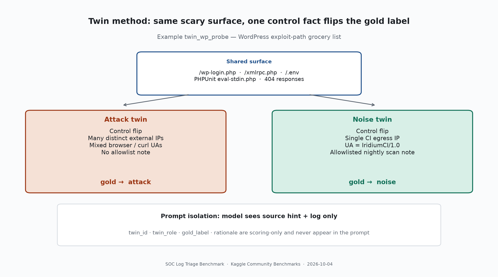

#### Twin A — `twin_wp_probe` (web scan)

**Shared surface:** `/wp-login.php`, `/xmlrpc.php`, `/.env`, PHPUnit `eval-stdin.php` — the classic WordPress exploit-path grocery list.

| Role | Control flip | Gold |
| --- | --- | --- |
| Attack | Many distinct external IPs (`203.0.113.*`, `198.51.100.*`), mixed UAs | `attack` |
| Noise | Single allowlisted CI egress `34.102.136.180`, UA `IridiumCI/1.0`, comment that IP is nightly surface scan | `noise` |

**Why gold is right:** path list alone is not compromise. Multi-IP hostile recon ≠ one known CI scanner. A model that labels both `attack` failed context reading, not “security awareness.”

#### Twin B — `twin_iam_denied` (cloud IAM)

**Shared surface:** `prod-invoices` + `AccessDenied` / object reads around the same timestamp window.

| Role | Control flip | Gold |
| --- | --- | --- |
| Misconfig | `deploy-bot` removes `s3:GetObject`; app principal then gets AccessDenied | `misconfig` |
| Attack | Unknown OIDC assume, MFA false, Tor-ish IP, **successful** bulk invoice downloads | `attack` |

**Why gold is right:** AccessDenied after a deploy bot policy tighten is the textbook post-deploy outage. Bulk successful GetObject after shady AssumeRole is exfil.

#### Twin C — `twin_api_post` (web API)

**Shared surface:** `POST /api/v1/transfer` from the same client IP.

| Role | Control flip | Gold |
| --- | --- | --- |
| Needs more data | Status/body truncated (“upstream closed”; shipper note) | `needs_more_data` |
| Attack | Complete line: `sqlmap/1.8`, HTTP 200, SQLi-shaped body | `attack` |

**Why gold is right:** interesting endpoints without status/body must not be escalated to confirmed attack. Completing the line with an attack tool UA changes the decision.

#### Twin D — `twin_ssh_auth` (auth)

**Shared surface:** failed SSH passwords around bastion.

| Role | Control flip | Gold |
| --- | --- | --- |
| Noise | Failed passwords for **invalid** users from internet background IPs; preauth close | `noise` |
| Attack | Fail then **Accepted** for real user `deploy`, `passwd root`, lateral hop bastion→app | `attack` |

**Why gold is right:** internet background against invalid users is daily noise. Fail→success→privilege change→lateral movement is a compromise chain.

#### Twin E — `twin_app_500` (app errors)

**Shared surface:** checkout service ERROR bursts.

| Role | Control flip | Gold |
| --- | --- | --- |
| Misconfig | `db connection refused` aligned with deploy flipping `DATABASE_HOST` | `misconfig` |
| Attack | SQL syntax errors with `SLEEP` / `UNION SELECT credit_card` in query string | `attack` |

**Why gold is right:** correlation with deploy config change ≠ intrusion. Injection payloads in `qs` causing DB errors = attack.

#### Twin F — `twin_waf_block` (WAF)

**Shared surface:** security-adjacent HTTP events near `/index.php` / admin paths.

| Role | Control flip | Gold |
| --- | --- | --- |
| Noise | WAF **BLOCK** of `zgrab` GenericLFI probes | `noise` |
| Attack | WAF **ALLOW** of bulk `/admin/export` after password reset from new geo (US-CA → RU), session reuse | `attack` |

**Why gold is right:** blocked internet scanners are working-as-intended noise. Authenticated bulk export after reset + geo jump is ATO, even if WAF did not fire.

#### Twin G — `twin_s3_public` (cloud storage)

**Shared surface:** public/anonymous S3 GETs on `prod-assets`.

| Role | Control flip | Gold |
| --- | --- | --- |
| Misconfig | Terraform set `public-read`; public fetch of `branding/logo.png` + list | `misconfig` |
| Attack | Anonymous multi-MB downloads of `private/payroll-*.csv` and `ssn-export.csv` | `attack` |

**Why gold is right:** public logo after ACL mis-set is a bad config finding. Bulk private payroll/SSN pull is exfil. Same “public bucket” keyword, different severity and label.

#### Twin H — `twin_vpn_login` (VPN auth)

**Shared surface:** successful VPN auth for `jsmith`.

| Role | Control flip | Gold |
| --- | --- | --- |
| Needs more data | Success with empty device and timed-out geo | `needs_more_data` |
| Attack | MFA `bypassed_legacy`, impossible travel US-NY→KZ, password reset 0.2h ago, 12MB to internal host | `attack` |

**Why gold is right:** incomplete enrichment must force abstain. Full ATO + lateral volume is attack.

### 3.4 Controls (unpaired anchors)

| ID | Gold | Purpose |
| --- | --- | --- |
| `ctrl_noise_healthcheck` | noise | kube-probe `/healthz` — should never page |
| `ctrl_noise_cert_renew` | noise | certbot “not yet due” — routine ops |
| `ctrl_misconfig_cors` | misconfig | prod `CORS *` after deploy, no exploit |
| `ctrl_misconfig_debug` | misconfig | `DEBUG=true` in production, no exploit |
| `ctrl_attack_credstuff` | attack | many users, one IP, fail/success mix |
| `ctrl_needs_truncated_stack` | needs_more_data | truncated stack, no request/user/IP |

Controls stop a model from “gaming twins” with a heuristic that only works on paired items.

### 3.5 Scoring

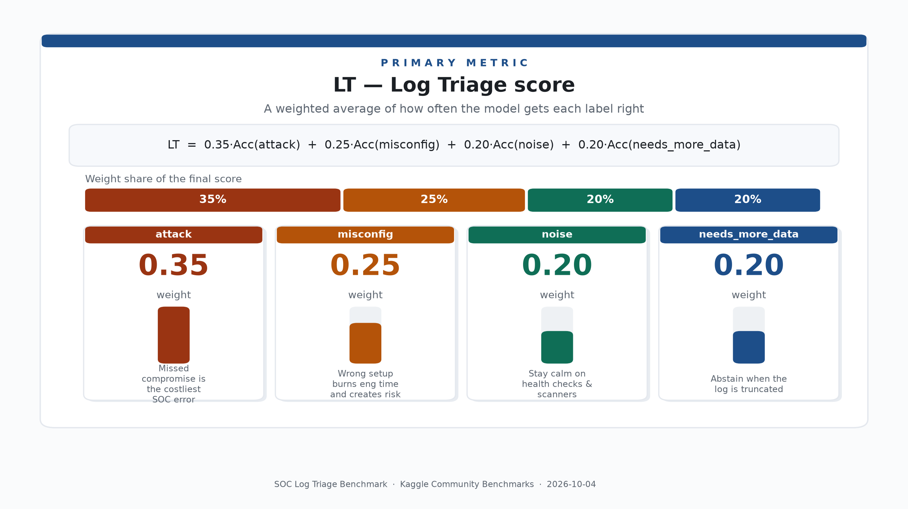

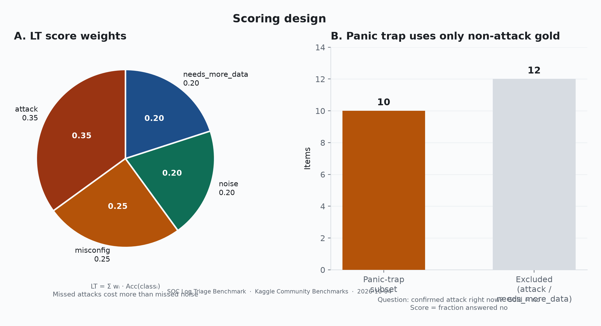

**Primary metric — LT (Log Triage score):**

```text
LT = 0.35 × Acc(attack)
   + 0.25 × Acc(misconfig)
   + 0.20 × Acc(noise)
   + 0.20 × Acc(needs_more_data)
```

Weights are intentional:

- **Attack highest (0.35)** — missed compromise is the costliest error class in most SOC SLAs.  
- **Misconfig next (0.25)** — wrong bucket burns engineering time and creates real risk.  
- **Noise and abstain equal (0.20)** — calmness and intellectual honesty share the remaining mass.

Per-class accuracy is computed only over items with that gold label, then mixed. Perfect labeling → LT = 1.0 (unit-tested offline).

**Secondary metric — Panic trap** (`log-triage-panic-trap`):

- Subset: gold ∈ {`noise`, `misconfig`} only (**10 items**).  
- Prompt: “Is there a *confirmed active attack or compromise* right now?”  
- Gold answer: **no**.  
- Score: fraction answered no (string `yes`/`no` schema — bool schemas broke some models).  
- Parse failure counts as panic (miss).

Related diagnostic (computed offline, not the Kaggle reward):  

```text
Panic Gap = (# noise∪misconfig predicted as attack) / (# noise∪misconfig)
```

Panic Gap = 0 is ideal calmness on the 4-way task; Panic trap = 1.0 is ideal calmness on the yes/no task.

### 3.6 Evaluation protocol

| Setting | Choice |
| --- | --- |
| Platform | Kaggle Community Benchmarks |
| Tasks | `log-triage-label`, `log-triage-panic-trap` |
| Prompt | Source hint + log; structured `label` + `explanation` |
| Parallelism | `n_jobs=1` |
| Failures | `on_failure=continue`; infra 429/503/quota reported separately from ability |
| Cohort A (primary) | Newest catalog flagships (Sonnet 5, Opus 5, GPT-5.6 Luna/Sol, GPT-6, Gemini 3.x, Grok 4.6, …) |
| Cohort B | Popular / cheap baselines (Flash family, nano, Haiku, Gemma, older Sonnet/GPT) |
| Charts | Regenerated from frozen scores via `scripts/make_log_triage_charts.py` |

We **do not** fold platform ERR into “model is bad at SOC.” A 503 is infrastructure. A completed LT of 0.039 after a full run is a model (or format) failure and is reported as such.

---

## 4. Results

### 4.1 Expensive newest vs cheap flash/nano

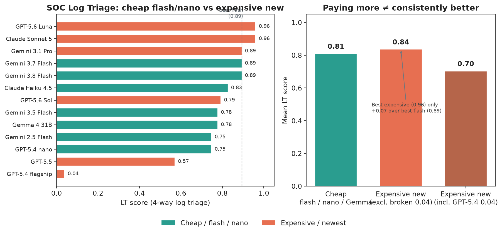

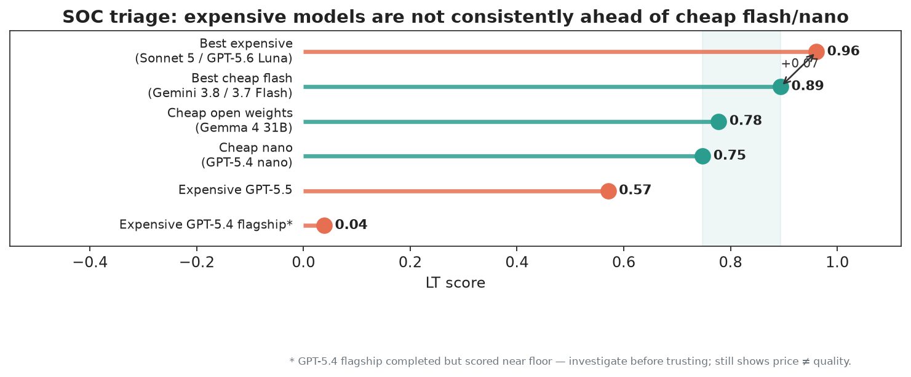

**Tier summary (usable completed label runs):**

| Tier | Best models | Best LT | Panic (finishers) |
| --- | --- | ---: | ---: |
| Expensive newest (usable) | Claude Sonnet 5, GPT-5.6 Luna | **0.961** | 1.000 |
| Cheap flash | Gemini 3.8 / 3.7 Flash | **0.894** | 1.000 |
| Cheap open / nano | Gemma 4 31B, GPT-5.4 nano | 0.748–0.778 | 1.000 |
| Expensive but weaker here | GPT-5.5, GPT-5.4 flagship, GPT-5.6 Sol | 0.039–0.793 | often 1.000* |

\*Panic can be perfect even when 4-way LT collapses — models may refuse the yes/no panic question while still mismapping the finer taxonomy. That is why we keep two tasks.

**Delta that drives RQ2:**

```text
Δ = LT(best expensive usable) − LT(best cheap flash)
  = 0.961 − 0.894
  = 0.067
```

On a 22-item weighted probe, that is real — roughly one to two class-weighted mistakes — but it is **not** “throw away flash” large.

### 4.2 Newest flagship table (primary ranking)

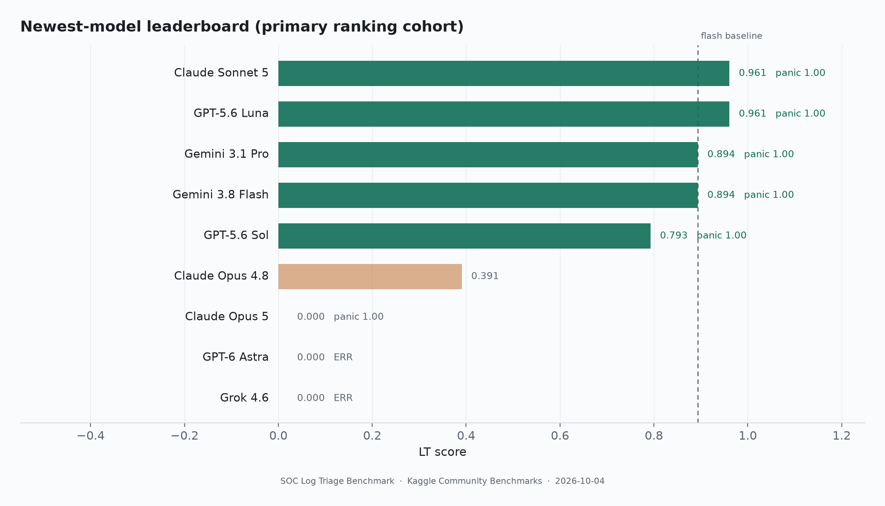

| Model | LT | Panic | Status |
| --- | ---: | ---: | --- |
| Claude Sonnet 5 | **0.961** | 1.000 | Top usable |
| GPT-5.6 Luna | **0.961** | 1.000 | Top usable |
| Gemini 3.1 Pro | 0.894 | 1.000 | Ties best flash |
| Gemini 3.8 Flash | 0.894 | 1.000 | Best cheap |
| GPT-5.6 Sol | 0.793 | 1.000 | Behind flash |
| Claude Opus 4.8 | 0.391 | — | Weak / incomplete panic |
| Claude Opus 5 | 0.000 | 1.000 | Label unusable; panic OK |
| GPT-6 Astra | 0.000 | — | ERRORED |
| Grok 4.6 | 0.000 | — | ERRORED |

### 4.3 Popular / cheaper cohort (secondary)

| Model | LT | Notes |
| --- | ---: | --- |
| Claude Opus 4.6 | 0.921 | Provisional (quota noise on run) |
| Gemini 3.7 Flash | 0.894 | Strong cheap |
| Gemini 2.5 Pro | 0.867 | Close |
| Claude Haiku 4.5 | 0.827 | Solid mid |
| Gemini 3.5 Flash / Gemma 4 31B | 0.778 | |
| Gemini 2.5 Flash / GPT-5.4 nano | 0.748 | |
| GPT-5.4 mini | 0.581 | |
| GPT-5.5 | 0.571 | Flagship name, mid score |
| Claude Sonnet 4.6 | 0.530 | |
| DeepSeek R1 | 0.106 | Likely parse / schema issues |
| GPT-5.4 (flagship) | 0.039 | Completed near-floor — transcript audit needed |
| Sonnet 4.5 / Qwen3-Next | — | 429 / 503 |

### 4.4 Panic trap: false alarms are already “solved” by cheap models

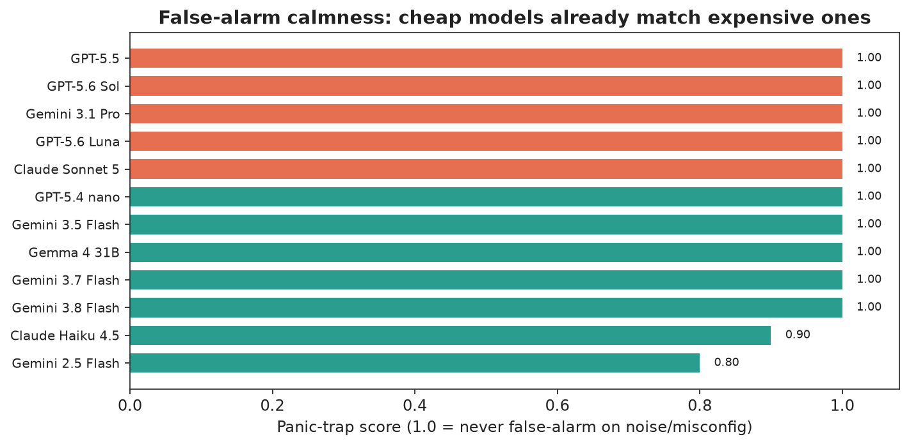

When the question collapses to confirmed-attack yes/no on the 10 noise/misconfig bundles, **flash/nano and expensive finishers both land near 1.0**. Haiku was 0.900; Gemini 2.5 Flash 0.800 on an older run. Paying more does **not** buy calmer panic behavior on this probe.

**Takeaway (RQ3):** the separation between models lives in the **4-way label**, especially misconfig vs attack and abstain vs guess — not in “will you scream attack on kube-probe?”

### 4.5 What “proof” means in this paper

We claim a **reproducible diagnostic**, not a meta-analysis of all security AI:

1. Frozen synthetic dataset in git (`dataset/items.jsonl`).  
2. Deterministic gold scored by `param_id` against structured labels.  
3. Public Kaggle tasks with downloadable run artifacts.  
4. Offline unit tests that perfect hits → LT=1.0 and all-attack-on-noise → Panic Gap=1.0.  
5. Charts regenerated only from those scores.

N is small **on purpose**. Twin probes are qualitative stress tests with quantitative scores. If a vendor cannot clear twin_wp_probe + twin_iam_denied, a larger random sample will not save them.

---

## 5. Discussion

### 5.1 Answering the RQs

**RQ1 — Can models do it?**  
Yes, the top usable newest models reach LT ≈ 0.96. The task is solvable without tools or multi-hop investigation.

**RQ2 — Do expensive newest beat cheap flash?**  
Only the *best* expensive models do, and only by **+0.067 LT**. Several expensive or “flagship-named” models lose to Gemini Flash. Defaulting to expensive is not evidence-based on this probe.

**RQ3 — Do expensive models panic less?**  
No meaningful gap among finishers. Cheap already matches.

### 5.2 Why we believe the conclusions are right (and where they could fail)

**Supporting arguments:**

1. **Construct validity.** Twins isolate the skill we claim to measure (context flip), not keyword spotting.  
2. **Prompt hygiene.** Gold never appears in the model-visible fields.  
3. **Dual metrics.** LT and panic disentangle taxonomy skill from yes/no calmness.  
4. **Cross-cohort consistency.** Flash strength appears in both newest and popular tables.  
5. **Honest infra handling.** ERR/0.0 from quota is not weaponized against a model family.

**Threats to validity (we state them so others can attack us correctly):**

| Threat | Impact | Mitigation / next step |
| --- | --- | --- |
| Small N | High variance; one miss moves score | Keep as probe; enlarge after adjudication playbook |
| Synthetic logs | May understate real messiness | Still beats unpublishable customer dumps for open science |
| Single-shot, no tools | Not a full IR investigation | Explicit scope: first-pass triage |
| Schema / parse failures | Can look like “dumb model” | Flag GPT-5.4 / DeepSeek for transcript audit |
| Platform quota | Newest flagships incomplete | Report ERR separately; retry when capacity returns |
| Author-labeled gold | Single adjudicator bias | Publish rationales; invite adversarial re-label |

### 5.3 Relation to ART

| Benchmark | Question | Modality |
| --- | --- | --- |
| ART | Did the model respect the **code patch**? | Source / sink / reachability |
| LT | Did the model stay calm and precise on the **log**? | Ops telemetry |

Same philosophy: **false alarms + abstain + minimal pairs**. Together they argue that “security AI” quality is **context discipline**, not scary-token spotting.

### 5.4 Practical recommendation for SOC / AI platform buyers

1. **Measure** on a twin-style triage set (this one or your own).  
2. **Route** first-pass volume to flash/nano if LT is within your accuracy budget.  
3. **Escalate** only the hard slice to Sonnet 5 / GPT-5.6 Luna (or whatever wins *your* distribution).  
4. **Never** buy on chat demos of a single scary line.  
5. **Separate** infra failures from ability scores in vendor bake-offs.

---

## 6. What we would measure next

1. **Multi-hop evidence:** model must request the missing field instead of guessing.  
2. **Costed policy score:** weight false pages vs missed attacks in dollars, not only accuracy.  
3. **Diff-aware triage** for detection-rule PRs (ART×LT hybrid).  
4. **Larger N** once dual adjudication is routine.  
5. **Transcript audits** for near-floor completers (GPT-5.4 flagship, DeepSeek R1).

---

## 7. Conclusion

SOC analysis is where models waste money by being dramatic.

On **SOC Log Triage**, the evidence says:

- **Best expensive usable:** Sonnet 5 ≈ GPT-5.6 Luna (LT 0.961)  
- **Best cheap:** Gemini 3.8/3.7 Flash (LT 0.894)  
- **Gap:** ~7 points — real, not decisive enough to discard flash by default  
- **Panic:** cheap already matches expensive  
- **Twins prove the skill:** same scary tokens, different gold — models must read control facts, not path lists  

If a vendor pitch is “our frontier model will fix the SOC queue,” ask for a twin-style log triage score with panic/false-alarm reporting — not a chat demo on one scary line.

---

## Appendix A — Full twin catalog (quick reference)

| Twin ID | Class | Attack cue | Non-attack cue | Non-attack gold |
| --- | --- | --- | --- | --- |
| `twin_wp_probe` | web_scan | multi-IP exploit paths | allowlisted CI UA/IP | noise |
| `twin_iam_denied` | cloud_iam | shady AssumeRole + bulk GetObject | deploy-bot policy tighten | misconfig |
| `twin_api_post` | web_api | sqlmap + SQLi body + 200 | truncated status/body | needs_more_data |
| `twin_ssh_auth` | auth | fail→success→root→lateral | invalid-user background | noise |
| `twin_app_500` | app_error | SQLi in qs | deploy DATABASE_HOST flip | misconfig |
| `twin_waf_block` | waf | ATO export after reset/geo | blocked zgrab | noise |
| `twin_s3_public` | cloud_storage | payroll/SSN bulk get | public logo after ACL | misconfig |
| `twin_vpn_login` | auth | MFA bypass + travel + volume | missing device/geo | needs_more_data |

---

## Appendix B — Reproduce

```bash
git clone https://github.com/mziqudhd92/kaggle-soc-log-triage-benchmark
cd kaggle-soc-log-triage-benchmark
python scripts/validate_log_triage_jsonl.py
bash scripts/validate_log_triage_local.sh

kaggle b t run log-triage-label -m gemini-3.8-flash --wait
kaggle b t run log-triage-label -m claude-sonnet-5-default --wait
kaggle b t run log-triage-panic-trap -m gemini-3.8-flash --wait
```

Figures: `python scripts/make_log_triage_charts.py` → cover, LT/gap/panic/takeaway, dataset composition, twin schematic, scoring design, newest leaderboard.

---

## My Benchmark

**Source (MIT):** https://github.com/mziqudhd92/kaggle-soc-log-triage-benchmark  

**Kaggle tasks**

- https://www.kaggle.com/benchmarks/tasks/moranzavdi/log-triage-label  
- https://www.kaggle.com/benchmarks/tasks/moranzavdi/log-triage-panic-trap  

**Artifacts:** `results/NEWEST_COMPARISON.md`, `results/POPULAR_COMPARISON.md`, `MODELS.md`, `assets/*`

**Safety:** synthetic logs only; defensive research; no live targeting; documentation/RFC IPs only.

**Credit:** Companion to [ART](https://github.com/mziqudhd92/kaggle-art-benchmark); inspired by proof-over-speculation tooling ([Iridium](https://github.com/mziqudhd92/Iridium)).
